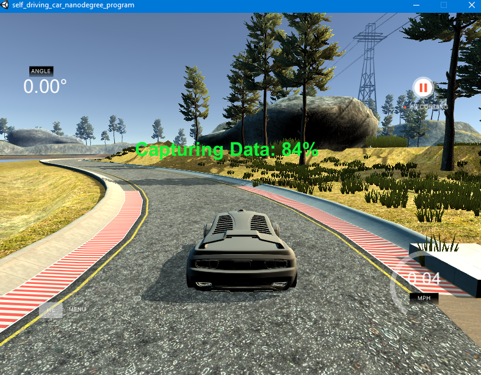
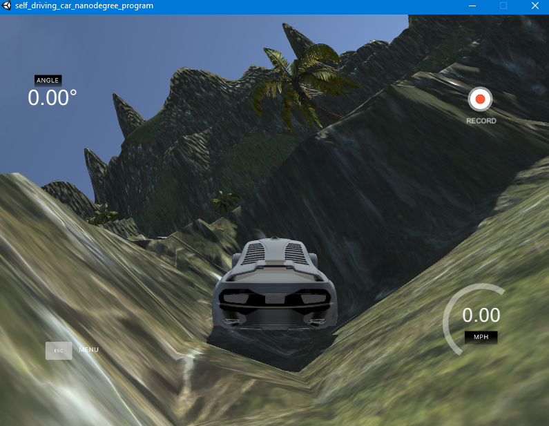
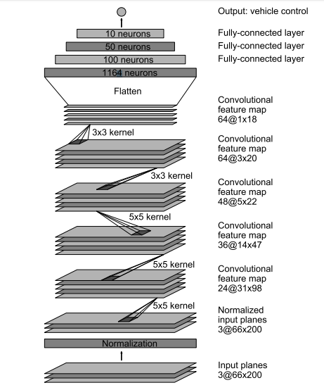
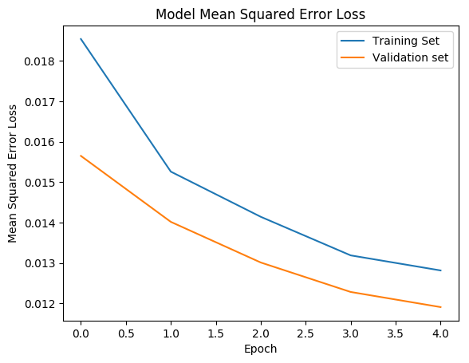
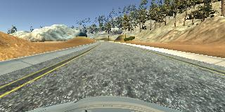
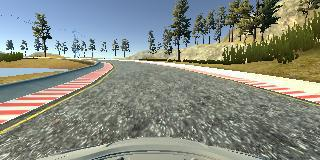
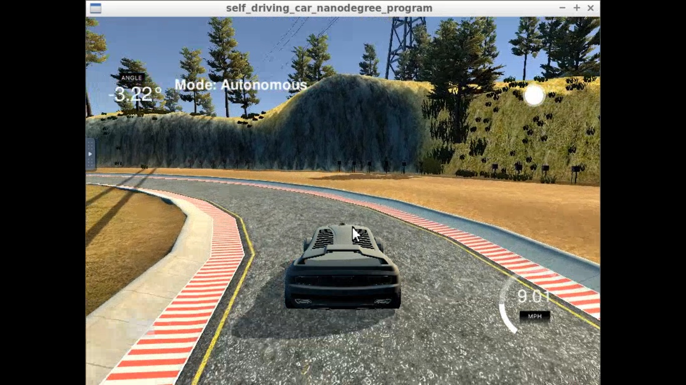

# **Behavioral Cloning** <!-- omit in toc -->

[](http://www.udacity.com/drive)

## **Behavioral Cloning of Lateral Control using NVIDIA's End-to-End Learning Model** <!-- omit in toc -->


#### In this project, a simplified version of NVIDIA's [End-to-End Learning Model for Self-Driving Cars](https://arxiv.org/pdf/1604.07316v1.pdf) is used to automate lateral control of a vehicle. Training Data Collection and Testing of the Trained Model is done via [Udacity and Unity's Self-Driving Car Simulator.](https://github.com/udacity/self-driving-car-sim)<!-- omit in toc -->
---

## **Behavioral Cloning Project**<!-- omit in toc -->

The goals / steps of this project are the following:
* Using the simulator to collect data of good driving behavior
* Building a convolution neural network in Keras that predicts steering angles from images
* Training and validating the model with a training and validation set
* Testing that the model successfully drives around track one without leaving the road
* Summarizing the results with a written report

[//]: # (Image References)

[image1]: data/IMG/left_2016_12_01_13_43_08_639.jpg "Left Image"
[image2]: data/IMG/center_2016_12_01_13_43_08_639.jpg "Center Image"
[image3]: data/IMG/right_2016_12_01_13_43_08_639.jpg "Right Image"

---  
### **Table of Contents:**
- [**1. Dataset**](#1-dataset)
  - [**1.1 About the dataset**](#11-about-the-dataset)
  - [**1.2 Dataset Visualization**](#12-dataset-visualization)
  - [**1.3 Data Collection**](#13-data-collection)
- [**2. Data Preprocessing**](#2-data-preprocessing)
  - [**2.1. Data Augmentation**](#21-data-augmentation)
    - [**2.1.1. Multiple Camera Angles**](#211-multiple-camera-angles)
    - [**2.1.2. Mirrored Images**](#212-mirrored-images)
  - [**2.2. Image Processing**](#22-image-processing)
    - [**2.2.1. Cropping the images**](#221-cropping-the-images)
    - [**2.2.2. Conversion to YUV image format**](#222-conversion-to-yuv-image-format)
- [**3. Model Architecture**](#3-model-architecture)
- [**4. Training and Validating the Model**](#4-training-and-validating-the-model)
- [**5. Testing the trained model in the Simulator**](#5-testing-the-trained-model-in-the-simulator)
- [**Further Improvements**](#further-improvements)

---

### **Important Contents of the repository**

* `data/`     - Directory containing the recorded driving behavior using the simulator in training model
* `clone.py`  - Script for implementation and training of the model using Keras
* `model.h5`  - Trained model
* `drive.py`  - Script for driving the car autonomously in the simulator using the trained model
* `video.mp4` - Video recording of the car driving autonomously using the trained model 

### **Instructions for Use**

1. [Udacity's Simulator](https://github.com/udacity/self-driving-car-sim) can be cloned from GitHub
2. The implemented model in clone.py is trained and saved as `model.h5` using:
    ```sh
    python clone.py 
    ```
3. The trained model `model.h5` is loaded into the simulator environment using `drive.py`:
    ```sh
    python drive.py model.h5 
    ```
4. Additionally, screenshots of the car in the simulator's autonomous mode can be recorded using:
    ```sh
    python drive.py model.h5 video
    ```
5. Finally, a video can be created using the recorded screenshots using:
    ```sh
    python video.py video
    ```
---

## **1. Dataset**
### **1.1 About the dataset**

The dataset contains recordings of driving behavior in Track 1 of Udacity's Simulator Environment. 

The dataset contains the following features of the driving behavior at a given time instant:

* Left Camera Image
* Center Camera Image
* Right Camera Image
* Steering Angle
* Throttle
* Braking
* Speed

Since, the main focus is on lateral control, only the three types of images and steering angle measurements are used by the model. The `driving_log.csv` contains the dataset (with paths to the images) and the images of size 160x320 are found in `IMG/` directory.  

### **1.2 Dataset Visualization**

At each time frame, pictures are captured by three front cameras at the left, center and right positions as shown below: 

![Left Camera Image][image1]
![Center Camera Image][image2]
![Right Camera Image][image3]

The above time frame is associated with the following measured values of lateral and longitudinal controls: 

| Measurement    |   Value   |
| :------------- | :-------: |
| Steering Angle | -0.135712 |
| Throttle       | 0.9855326 |
| Braking        |     0     |
| Speed          |  30.1853  |

### **1.3 Data Collection**

The data is collected by running the Self-Driving Simulator in Training Mode and keeping the car at the center of the lane. Track 1 is relatively easy to drive manually and the data is collected for multiple laps as shown below:



Track 2 is a difficult track and posed challenges in collecting good driving behavior. An example of my driving attempt on Track 2 is shown below:



In order to use better quality data for training the Deep Neural Network Model, the default dataset provided by Udacity under `data/` directory was used rather than my personal driving behavior. 

## **2. Data Preprocessing**
### **2.1. Data Augmentation**
#### **2.1.1. Multiple Camera Angles**

The Autonomous Mode of the Simulator uses the image from the center camera to make the steering angle control predictions. By altering the steering angles corresponding to the left and right camera images in the training dataset, we could obtain augmented data for the same time frame. 

The following logic is used for steering angle correction to help keep the vehicle at the center of the lane:  
* For the left image, steering angle is shifted towards the right by a factor 0.2
* For the center image, measured steering angle is used
* For the right image, steering angle is shifted towards the left by a factor 0.2

#### **2.1.2. Mirrored Images**

Since the Track 1 is left-turn dominated due to the counter-clockwise lap, data could be further augmented by mirroring the images and steering angles horizontally to help the model generalize better. The images are flipped using the `flip` function from `OpenCV` library and the steering angles are converted to the opposite sign of magnitude. 

### **2.2. Image Processing**
#### **2.2.1. Cropping the images**

The images from the cameras contain details such as the hills, lake, and other off-road features that do not provide any valuable information to the model. The images also contain the front hood of the vehicle which also does not provide any valuable information. These details can be eliminated from the image using the `Cropping2D` layer as a Lambda layer before the Convolutional Layers of the model. Therefore, the top 50 pixels and the bottom 20 pixels are cropped. 

#### **2.2.2. Conversion to YUV image format**

According to NVIDIA's model, the image inputs to the Convolutional Neural Network are in the [`YUV`](https://en.wikipedia.org/wiki/YUV) format. Thus, the `cvtColor` function from `OpenCV` library is used to convert the `BGR` format (format in which `cv2.imread()` function reads the images from their paths) to `YUV` format.

## **3. Model Architecture**

The Model Arhcitecture is based on NVIDIA's [End-to-End Learning for Self-Driving Cars](https://arxiv.org/pdf/1604.07316v1.pdf) which *maps raw pixels from a single front-facing camera directly to steering commands.*

The Model Architecture from their paper is shown in the image below:



The output layer contains one neuron corresponding to the steering angle control. The model was modified in order to account for overfitting to the training set and can be summarized in the table below: 


| Layer                   |    Output Shape     | Parameters | Description                                                                    |
| :---------------------- | :-----------------: | :--------: | :----------------------------------------------------------------------------- |
| Lambda layer            | (160, 320, 3) |     0      | Normalizes the pixels values to (-1, 1) and centers them around the mean of zero |
| Cropping2D              | (90, 320, 3)  |     0      | Crops the images to discard background and hood details                        |
| Convolutional Layer 1   | (43, 158, 24) |    1824    | Kernel = 5x5, Strides = 2x2, `relu` activation                                 |
| Dropout 1               | (43, 158, 24) |     0      | Rate = 0.25                                                                    |
| Convolutional Layer 2   | (20, 77, 36)  |   21636    | Kernel = 5x5, Strides = 2x2, `relu` activation                                 |
| Dropout 2               | (20, 77, 36)  |     0      | Rate = 0.25                                                                    |
| Convolutional Layer 3   |  (8, 37, 48)  |   43248    | Kernel = 5x5, Strides = 2x2, `relu` activation                                 |
| Dropout 3               |  (8, 37, 48)  |     0      | Rate = 0.25                                                                    |
| Convolutional Layer 4   |  (6, 35, 64)  |   27712    | Kernel = 3x3, Strides = 1x1, `relu` activation                                 |
| Dropout 4               |  (6, 35, 64)  |     0      | Rate = 0.25                                                                    |
| Convolutional Layer 5   |  (4, 33, 64)  |   36928    | Kernel = 3x3, Strides = 1x1, `relu` activation                                 |
| Dropout 5               |  (4, 33, 64)  |     0      | Rate = 0.50                                                                    |
| Flatten                 |    (8448)     |     0      | Flattens to a 1D vector                                                        |
| Fully Connected Layer 1 |     (100)     |   844900   | `relu` activation                                                              |
| Fully Connected Layer 2 |     (50)      |    5050    | `relu` activation                                                              |
| Fully Connected Layer 3 |     (10)      |    510     | `relu` activation                                                              |
| Fully Connected Layer 4 |      (1)      |     11     | `relu` activation                                                              |


* Total parameters: 981,819
* Trainable parameters: 981,819
* Non-trainable parameters: 0

## **4. Training and Validating the Model**

The `clone.py` file contains the model to be trained. The `generator()` function is used to improve memory efficiency and process the images on the fly during the training process. The model was trained based on minimizing the `mse` - Mean Squared Error loss function since we are dealing with a regression problem. The `Adam` optimizer was used during training, with a batch size of 32. The model was trained for 5 epochs, and the trained model was saved as `model.h5` to be later used in running the Simulator in Autonomous Mode. 

The following results were obtained from the training: 



Due to the dropout layers to avoid overfitting to the training set, it is observed that the model generalizes well to the dataset. In fact, the validation losses are found to be lower than the training set, which implies an overfitting to the validation set. However, the performance of the model can be truly visually observed in the Simulator running in Autonomous Mode. 

## **5. Testing the trained model in the Simulator**

The `drive.py` script is used to run the Autonomous Mode of the Simulator based on the trained model. It is observed that the vehicle remains inside the drivable portion of the track, without swerving off-track. 

The videos from the front-facing cameras were generated using the `video.py` script and are included as `video1.mp4` and `video2.mp4`. 

Some images from the test run are included below: 





The screen-recording of the Simulator running in Autonomous Mode corresponding to the results seen in `video1.mp4` can be viewed on YouTube under [this link](https://www.youtube.com/watch?v=N6GlktZY3Xs). 



## **Further Improvements**
* Extending the dataset to include driving data from Track 2 to help the model generalize better.
* Additional Data Augmentation techniques as described in [NVIDIA's paper](https://arxiv.org/pdf/1604.07316v1.pdf) to include translation and rotation of images, and their corresponding steering measurements. 
* Collecting data about getting the vehicle back on track once it leaves the limits of the track, to help train the model learn to get back on track.
* The model could be extended to predict lateral as well as longitudinal controls to create a truly automated driving pipeline. 
